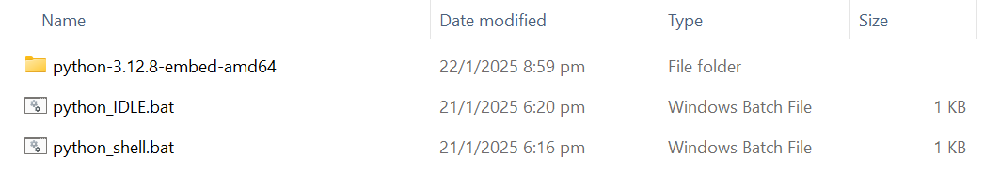
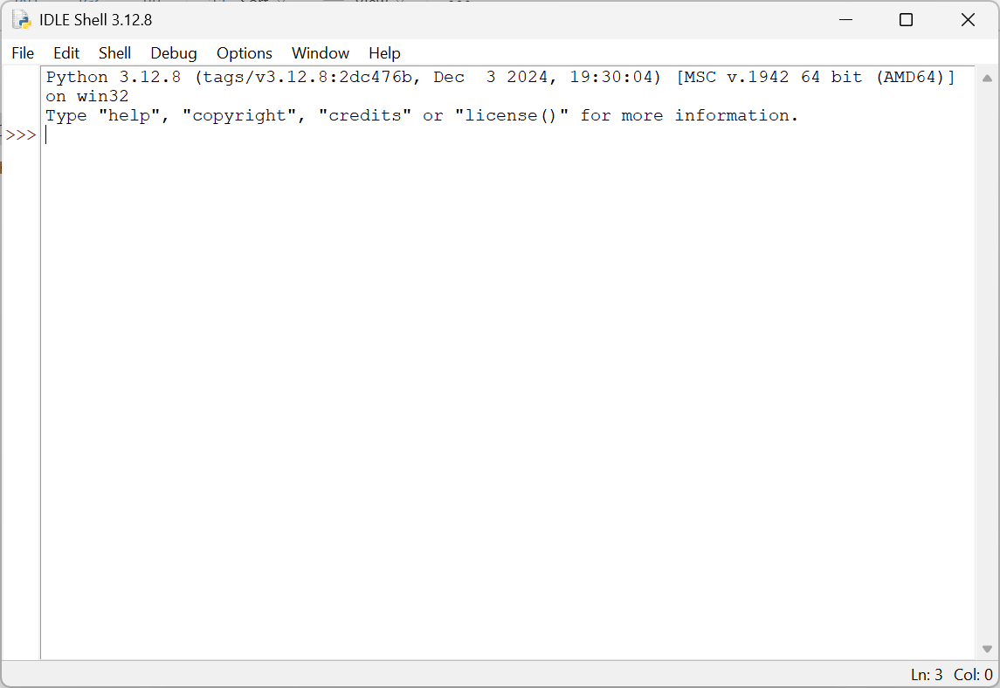
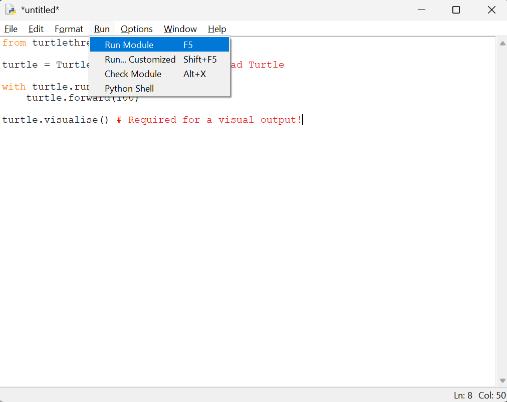
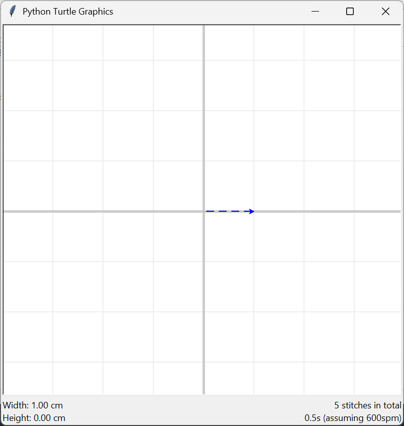

Installing TurtleThread
=======================

This version of TurtleThread is not available on PyPI. As such, we have alternative installation methods below.

Premade Windows Environment
^^^^^^^^^^^^^^^^^^^^^^^^^^^

For users on Windows, we provide a ZIP archive containing a complete install of Python 3.12.8 and TurtleThread. No
dependencies need to be installed manually.  

The ZIP archives are located on our `GitHub Releases <https://github.com/appventure-nush/TurtleThread/releases>`_. 
Note that there are two versions of the environment: the **minimal** version, which only includes Python and the core
functionality of TurtleThread, and the **full** version, which includes Python, the full functionality of TurtleThread,
demo files, and offline documentation.

We recommend the full install if storage is not a concern. However, in cases where the file size needs to be minimized
(e.g. to be deployed to a large number of devices), the minimal version is recommended.

After choosing which version to install, download the appropriate ZIP archive for your version. 

.. image::  ../../../_static/figures/installation/1.png 

Extract the ZIP archive using a program of your choice. A specialized archive extraction software like
`7-Zip <https://www.7-zip.org/>`_ is recommended for much faster extraction times.

Once complete, navigate to the main directory as seen below. Note that the files may vary according to the version
used.

There are two ``.bat`` files provided. ``python_IDLE.bat`` will run Python IDLE (Integrated Development and Learning
Environment), while ``python_shell.bat`` will run a the Python shell in a terminal.

For most purposes, we are interested in ``python_IDLE.bat``. Double-click the file and IDLE should launch after a short
while.

This instance of IDLE is independent of existing Python libraries on the system, and only contains the libraries needed
to run TurtleThread. To test its functionality, we will run a short TurtleThread program on it to test its functionality.

Use ``Ctrl+N`` or use the File menu to create a new file. Then, paste the following demo into the new file.

.. include-turtlethread:: demo.py
    :linenos:

Press ``F5``, or use the Run menu to run the file. IDLE will prompt for you to save the file if you have not done so.
Save the file anywhere on the system.

If all has gone well, a window with the visualisation of the stitch will appear!

Manual Installation via Pip
^^^^^^^^^^^^^^^^^^^^^^^^^^^

Firstly, ensure Python 3 is installed. The code is currently developed on Python 3.12, as such errors may occur if
other verisons are used. Please leave a `bug report <https://github.com/appventure-nush/TurtleThread/issues>`_ if
issues arise from using other versions of Python 3.

As this is a fork of TurtleThread, it must be installed via the following commands, and **NOT** from PyPI.
`Git <https://git-scm.com/>`_ is a required dependency.

To install all dependencies for TurtleThread (akin to that of the full version above), run the command below.

``pip install "turtlethread[full] @ git+https://github.com/appventure-nush/TurtleThread"``

If any errors occur and you are unable to fix them, you may opt to install the minimal version with less dependencies.

``pip install git+https://github.com/appventure-nush/TurtleThread``

If you have previously installed TurtleThread (from PyPI, by the original developers), it is recommended to uninstall
the previous version first.

``pip uninstall turtlethread``