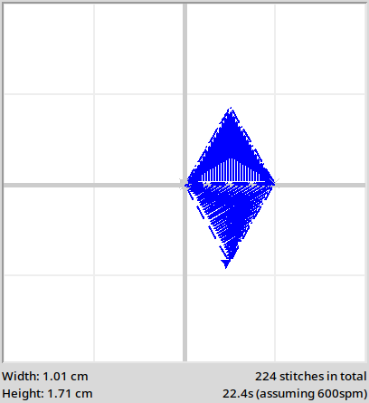

.. _fills:

Fills
=====

Filling in Python Turtle uses the functions ``turtle.begin_fill()`` and ``turtle.end_fill()``. TurtleThread uses a very
similar approach!

Using ``begin_fill()`` and ``end_fill()``
^^^^^^^^^^^^^^^^^^^^^^^^^^^^^^^^^^^^^^^^^

When you wish to begin filling a shape, use the ``begin_fill(...)`` function. The function accepts a ``Fill`` object,
which determines how the shape is to be filled.

Currently, there is only one fill algorithm: the ``ScanlineFill``. It accepts an ``angle`` argument, which sets the
direction of the fill. Alternatively, the string ``'auto'`` may be passed to the ``angle`` argument to allow
TurtleThread to automatically decide a direction. 

It is recommended that ``angle`` should be set manually for better performance.

.. include-turtlethread:: fills/eg_scanline_fill.py
    :linenos:
    :emphasize-lines: 9, 18

