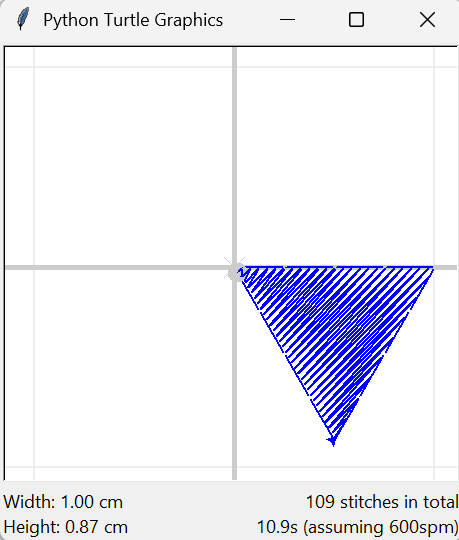

.. _fills:

Fills
=====

Filling in Python Turtle uses the functions ``turtle.begin_fill()`` and ``turtle.end_fill()``. TurtleThread uses a very
similar approach!

Using ``begin_fill()`` and ``end_fill()``
^^^^^^^^^^^^^^^^^^^^^^^^^^^^^^^^^^^^^^^^^

When you wish to begin filling a shape, use the ``begin_fill(...)`` function. The function accepts a ``Fill`` object,
which determines how the shape is to be filled.

The easiest method to fill is to use the ``begin_fill()`` and ``end_fill()`` functions without any parameters.
TurtleThread will automatically find an optimal angle to fill the polygon for you.

.. include-turtlethread:: fills/eg_fill_simplest.py
    :linenos:
    :emphasize-lines: 6, 15

Hollow fills
^^^^^^^^^^^^

Sometimes, it may be desirable to create a 'hollow' shape, or in other words, a filled polygon with some sections 
within cut out. In this case, a hollow fill can be used.

To create a hollow fill, trace the outline of the overall shape first. Then using a jump stitch, jump to the location 
within the shape where you wish to 'cut out' the filling. Thereafter, trace the outline of the inner 'hole' using any 
regular stitch.

.. include-turtlethread:: fills/eg_fill_hollow.py
    :linenos:

ScanlineFill
^^^^^^^^^^^^

For more control over the fill, you may pass a ``Fill`` into the ``begin_fill()`` function. As of now, the only 
``Fill`` available is the ``ScanlineFill``. It accepts an ``angle`` argument, which sets the direction of the fill. 
Alternatively, the string ``'auto'`` may be passed to the ``angle`` argument to allow TurtleThread to automatically 
decide a direction. 

It is recommended that ``angle`` should be set manually for better performance.

.. include-turtlethread:: fills/eg_scanline_fill.py
    :linenos:
    :emphasize-lines: 9, 19

.. image:: ../../../_static/figures/fills/scanline_fill.png 