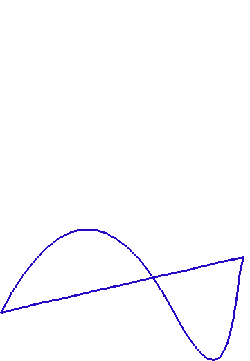
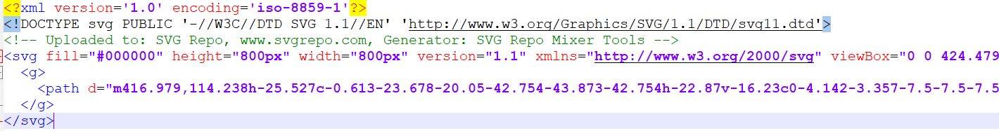

================================
(EXPERIMENTAL) Drawing SVG paths 
================================

Using the ``drawSVG`` function 
================================

To import the ``drawSVG`` function: 

.. include-turtlethread:: svg/svg_demo.py
    :linenos:
    :lines: 3

This function takes in 3 compulsory positional arguments: a turtle, the svg file path string, and the height of the SVG. The width can also be passed as a 4th positional argument, and defaults to the same value as the height. 

The keyword arguments it takes are: 

* ``fill`` : bool, optional. If True, the SVG will be filled. Default is True. 
* ``outline`` : bool, optional. If True, the SVG will be outlined. Default is False.
* ``full_fill`` : bool, optional. If True, the SVG will be fully filled if set to fill, otherwise it will be partialy filled. Default is True.
* ``fill_min_y_dist`` : int, optional. The minimum distance between fill points in the y direction. Default is 10 (1mm).
* ``fill_min_x_dist`` : int, optional. The minimum distance between fill points in the x direction. Default is 10 (1mm).

Here is a sample of it in action: 
.. include-turtlethread:: svg/svg_demo.py
    :linenos:

Debugging the SVG file 
======================

If you encounter issues with your SVG file, try the following checklist: 

* If it is fill: check that the fill path does not cross itself 
   * Our fill algorithm may not work if the path of the SVG crosses over 
   * Our fill feature is also very experimental, and there is a high chance of it having errors as of now. 
* Check the SVG file formatting; Our SVG processing algorithm is limited and might need some assistance from your side. 
   * First, view the SVG file as text. 
   * check the ``viewBox`` attribute 
   * check for a ``<path>`` tag 

If none of the above works, please raise a GitHub issue. 

Viewing the SVG file as text 
----------------------------
To view an SVG file as text, open an SVG file with a basic text editor like Notepad/Notepad++, or draw an SVG file into it. This will show the text of the SVG file, which should look like the below image: 

``viewBox`` attribute 
---------------------
In the ``<svg>`` tag in the SVG file, there should be a ``viewBox`` attribute, such as the following tag: 

``<svg fill="#000000" height="800px" width="800px" version="1.1" viewBox="0 0 424.479 424.479" xmlns="http://www.w3.org/2000/svg">``

If the ``viewBox`` attribute does not exist, you should create it yourself; this defines the 0% and 100% positions that the later SVG commands will use. 
Normally, if an SVG file does not specify the viewBox, you can use its height and width. For example: 

``<svg width="400" height="250" xmlns="http://www.w3.org/2000/svg">`` 

Can be changed to 

``<svg width="400" height="250" viewBox="0 0 400 250" xmlns="http://www.w3.org/2000/svg">``

We have not tested on SVG files with their viewBox starting with anything but ``0 0``, so there might be issues with those SVG files. For those, please raise a GitHub Issue for us to resolve it. 

``<path>`` tag 
--------------
In our program, we only draw the paths enclosed in a ``<path>`` tag in the SVG file. For example, we can see in the screenshot of what an SVG file looks like that there is a ``<path>`` tag that contains a string describing the path that the SVG file takes. 
First, check that the SVG path you are trying to drwa is in a ``<path>`` tag. 
Ensure that the path string ends with a "z" or "Z", which signals the end of the path. If it does not have one, then add it. 

If nothing works 
----------------
Raise a GitHub Issue. 

