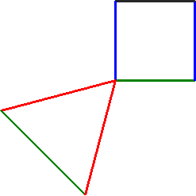

============
Using Colors
============

Changing color 
==============
TurtleThread supports using custom colors. Do note that for each different color, a separate thread has to be used — therefore, it is not feasible to make color gradients, and color switches should be used sparingly. 

The default or initial colour a turtle uses corresponds to the thread the machine starts connected to. This can be changed by setting ``color="<color_name>"`` as a parameter when initializing the turtle. 

To add a command for the turtle to switch to another color, use ``te.color("<color_name>")``

Exporting color files
=====================

Currently, TurtleThread supports exporting colours to the following file formats:

- .inf (Bernina machines)

To export a color file, the saving command should be:

``te.save('filename.exp', 'filename.inf')``

The second argument in ``te.save()``, which is optional, can be used to specify the color file name.

Demo
----

.. literalinclude:: color/color_demo.py
    :language: python
    :linenos:

Output:

::

    [EmbThread(thread='#008000'), EmbThread(thread='#0000ff'), EmbThread(thread='#000000'), EmbThread(thread='#0000ff'), EmbThread(thread='#ff0000'), EmbThread(thread='#008000'), EmbThread(thread='#ff0000')]

Saved files:

- test_color.exp
- test_color.inf
- test_color.png

