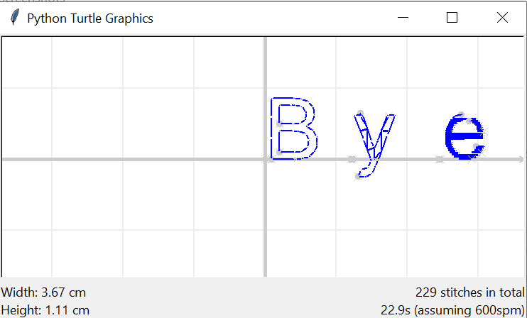

Drawing Text
============

Using the LetterDrawer
----------------------

To draw text, we use a ``LetterDrawer`` object. Below is the recommended way to initialize it.

.. literalinclude:: text/eg_text.py
    :language: python
    :lines: 1-6
    :linenos:
    :emphasize-lines: 4

In the indented block, we can use the LetterDrawer object, which is called ``ld``. The LetterDrawer allows you to 
utilize various functions to include text in your embroidery! 

Loading Fonts (``ld.load_font``)
--------------------------------

Before drawing text, we need to load some fonts. To load fonts, we use the ``ld.load_font`` function: 

.. literalinclude:: text/eg_text.py
    :language: python
    :lines: 7-8
    :linenos:

This function will search your system's installed fonts for the font file in order to load the font. As the system
relies on using the filename of the font files, if you are unable to load a font that is already installed in your
system, find where your system fonts are located in your filesystem, and use the file name of the font instead.

Generally, the filenames are one word, and similar to the first word of the name of the font. 

Alternatively, we can also initialize the ``LetterDrawer`` with ``load_common_fonts=True`` to attempt to load the fonts
Arial, Helvetica, and Comic Sans MS automatically. 

.. literalinclude:: text/eg_load_common_fonts.py
    :language: python
    :lines: 4-6
    :linenos:

Drawing Letters (``ld.draw_one_letter``)
----------------------------------------

To draw a letter with the letter drawer, we use ``ld.draw_one_letter``. 

.. literalinclude:: text/eg_text.py
    :language: python
    :lines: 10
    :linenos:

To draw a letter, we must first specify the font to draw it in, then the name of the letter to be drawn.
Then, we should specify the font size. A font size 100 or higher is **recommended**, as it will appear much smaller
in embroidery.

Note that ``' '`` (whitespace) should be inputted as ``'space'``. 

More parameters of this function are detailed under the `API reference <../api/text.html>`_.

Drawing gaps between Letters (``ld.draw_letter_gap``)
-----------------------------------------------------

Between every two letters, there is a gap. To draw this gap, we use ``ld.draw_letter_gap``. 

.. literalinclude:: text/eg_text.py
    :language: python
    :lines: 10-12
    :emphasize-lines: 2
    :linenos:

This function only takes in the font size of the text to draw the letter gap. 

Note that if your letter gap is too small or large, you can adjust the ratio by setting 
``turtlethread.LetterDrawer.letter_gap``. For example:
 
.. literalinclude:: text/eg_letter_gap.py
    :language: python
    :emphasize-lines: 6
    :linenos:

The default letter gap is ``0.03``. 

Drawing Strings (``ld.draw_string``)
------------------------------------

``ld.draw_string`` is a variation of ``ld.draw_one_letter`` that can draw entire strings. Note that spaces are also represented as
``' '``. 

.. literalinclude:: text/eg_draw_string.py
    :language: python
    :emphasize-lines: 10
    :linenos:

The syntax is similar to that of ``ld.draw_one_letter``. Refer to the `API reference <../api/text.html>`_.

Text Outline and Fill
---------------------

When embroidering text, we can choose to outline it. To outline text in ``ld.draw_one_letter`` or ``ld.draw_string``,
we set ``outline=True``.

.. literalinclude:: text/eg_text_outline.py
    :language: python
    :emphasize-lines: 8
    :linenos:

Outlining text is recommended for relatively small text sizes (less than 150), and preferred over fill as the fill can
get messy with small text sizes. 

We can also choose whether or not to fill text. We can either choose no fill, partial fill, or full fill. The below
code illustrates the three possibilities.

.. literalinclude:: text/eg_text_fill.py
    :language: python
    :emphasize-lines: 7,9,11
    :linenos:

- **No fill**
  - When having no fill, you should outline the text to make it visible (unless it is intentional to make it invisible) 

- **Partial fill**
  - When using partial fill, it is recommended to also outline the text. This is because the partial fill will look extremely messy without the outline to go with it. 
  - Note that partial fill is still partially experimental, and might sometimes fill out of the boundaries of the character.
  - Partial fill requires dependencies found only in the full version of TurtleThread.

- **Full fill**
  - When using full fill, it is not recommended to outline the text, as the edges of the text might already have stitches from the fill, and adding more stitches on top of them might cause the machine to get jammed.
  - Note that full fill is still partially experimental, and might sometimes not fill the entire character. 

Example and Walkthrough
-----------------------

Here is an example of the text functionality in TurtleThread.

.. literalinclude:: text/eg_text_walkthrough.py
    :language: python
    :lines: 1-15
    :linenos:

Unpacking the above code: 
  - **Line 3:** ``with turtlethread.LetterDrawer(te) as ld:`` creates the letter drawer that can be used. From here on, the ``ld`` variable can be accessed, until the end of the indented block.

  - **Line 5:** ``ld.load_font(fontname)`` loads the Arial font from the system's font files.
     
  - **Line 9:** ``ld.draw_one_letter(fontname, letter, fontsize)`` draws one letter, given a font name, letter, and font size. You can also choose whether it should be outlined or not, as well as whether it is filled or not. If it is filled, you can choose between partial fill and full fill by setting ``full_fill`` to ``False`` or ``True`` respectively. More details are in the `API reference <../api/text.html>`_. 

  - **Line 10:** ``ld.draw_letter_gap(fontsize)`` is used to draw the gap between two letters, and should be used with ``draw_one_letter``.

  - **Line 11:** ``ld.draw_string`` is similar to ``ld.draw_one_letter`` except it draws an entire string instead. Also, instead of parameters named ``fill`` and ``outline``, it has the parameters ``fills`` and ``outlines``, which can be a single boolean value or a list of boolean values. 
