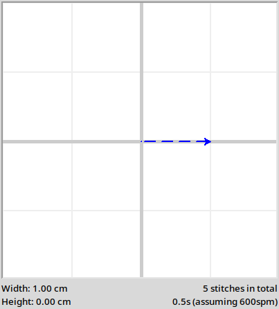

What's New?
======================

TurtleThread has been designed to follow the syntax of Python Turtle, so the transition should be relatively seamless!
However, to deal with the intricacies of embroidery, there are a few things you will have to take note of.

Stitch types 
-------------

In Python Turtle, a simple ``turtle.forward(100)`` will create a line.
However, in the world of embroidery, it is important to specify the **type of stitch**. 
TurtleThread has numerous stitches implemented, listed in the `API documentation <../api/stitch_groups.html>`_. 

As a simple example, let's use a *Running Stitch*. This is a common stitch that, when used in a straight line, will
create stitches at a constant distance apart. 

.. literalinclude:: whatsnew/eg_stitch.py
    :language: python
    :lines: 1-7
    :linenos:
    :emphasize-lines: 5

Notice the use of the ``with turtle.running_stitch(...)`` on line 4. This is known as a **context manager**, allowing 
us to easily segment our code into different sections with different stitches.

Alternatively, you may use the ``turtle.start_running_stitch(...)`` and ``turtle.cleanup_stitch_type()`` methods.

.. literalinclude:: whatsnew/eg_stitch_no_context_manager.py
    :language: python
    :lines: 5-7
    :linenos:
    :emphasize-lines: 1,3
    
Pen Up/Down
------------

In Turtle, the ``turtle.penup()`` and ``turtle.pendown()`` functions are used to move from one part of the canvas to
another without tracing its movement.

In embroidery, the way to do this is called a *Jump Stitch*. When using a jump stitch, the embroidery machine moves to
the specified location without leaving any stitches.

.. literalinclude:: whatsnew/eg_jump_stitch.py
    :language: python
    :lines: 5-11
    :linenos:

However, it is strongly advised to limit the number of jump stitches in your embroidery pattern. This is because during
embroidery, the embroidery machine has to temporarily pause embroidery and cut the thread, resulting in significant
delays to the embroidery process.

Exporting for Embroidery
-------------------------

The key purpose of TurtleThread is to allow for designs to be embroidered into reality. As such, knowing how to prepare 
files for embroidery is essential.

Firstly, ensure that you call the ``turtle.visualise()`` function. From the bottom of the interface, the estimated time
for how long the pattern will take to embroider is displayed, as well as the number of stitches if you wish to 
calculate the time needed for your embroidery machine.

There will also be warnings if the stitches are too dense. If the warning for stitch density appears, do not proceed 
with embroidery. The pattern may jam your machine and potentially break it.

Next, use the ``turtle.save()`` function to export the pattern to a file format that your embroidery machine supports.
The list of supported file formats is found in 
`PyEmbroidery's README <https://github.com/EmbroidePy/pyembroidery?tab=readme-ov-file#file-io>`_.

A brief example is given below.

.. literalinclude:: whatsnew/eg_save.py
    :language: python
    :linenos:
    :emphasize-lines: 11
